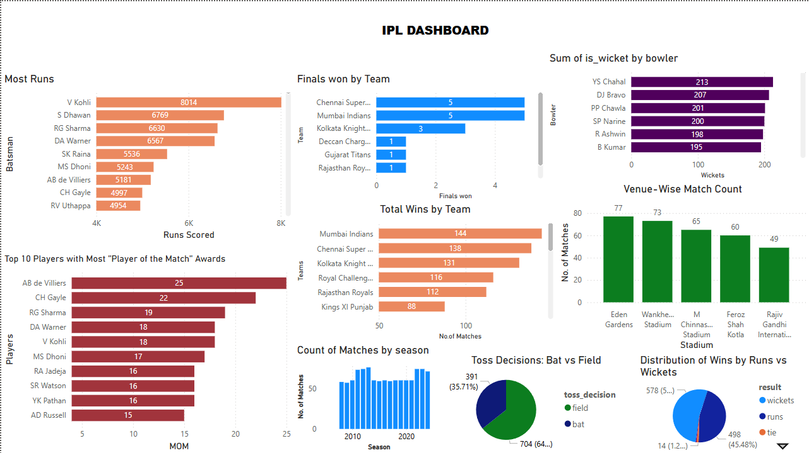

# 🏏 IPL Power BI Dashboard Analysis

This project explores IPL match data using Power BI. It includes visuals and insights such as:

- 📈 Season-wise match trends  
- 🌟 Player of the Match performance  
- 🏟️ Venue-wise match counts  
- 🎯 Toss decision impact  
- ⚔️ Match result margins (runs vs wickets)  

---

## 📊 Tools Used

- **Power BI** – for visualizations, DAX calculations  
- **Excel** – for minor cleaning  
- **Kaggle Dataset** – IPL dataset (2008–2020)  

📂 Dataset:  
Due to GitHub’s size limits, the dataset is not hosted here.

🔗 [Download IPL Dataset from Kaggle](https://www.kaggle.com/datasets/patrickb1912/ipl-complete-dataset-20082020)

---

## 📸 Dashboard Preview

---

## 📁 Files

- `IPL_Dashboard.pbix` – Power BI report file  
- `ipl_dashboard.png` – Screenshot of the dashboard  

---

## 👨‍💻 Author

- **Divyesh Shinde**  
- 💼 *Aspiring Data Analyst | Power BI Learner*  
